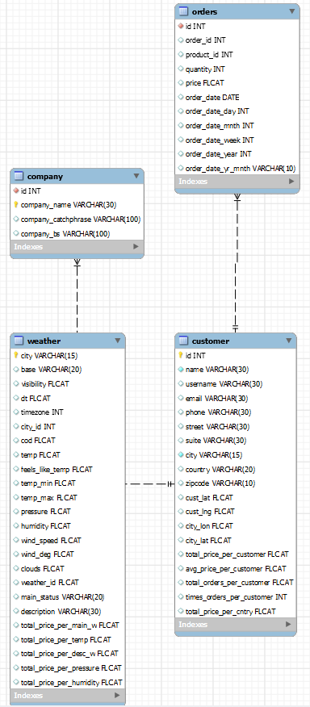
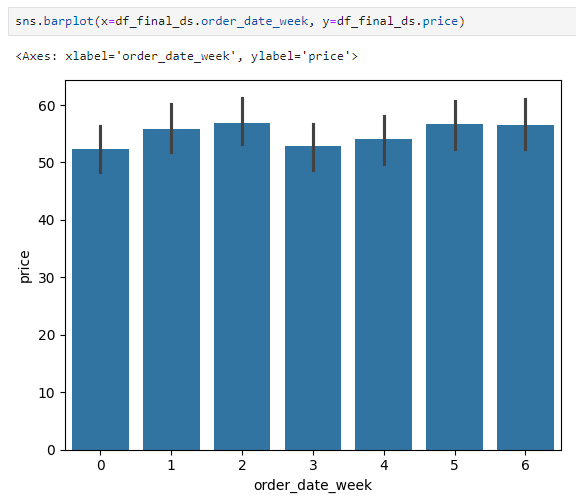

# aiq-assgmnt
AIQ Assignment

Documentation 
• Provide clear instructions on how to set up and run the data pipeline.
-> Data Pipeline code is dockerized. It is currently setup to run on demand. It can be dockerized with airflow as well to run it as per schedule.
Step 1: Download entire repo in your local machine
Step 2: Download MYSQL server from MYSQL website on your local machine. MYSQL Workbench will be required only for first step for setup via GUI. During
        setup, note user id and password and keep it safe
Step 3: Open constants.ini file and change/update userid and password to the one saved in step 2
Step 4: Ensure Docker is installed and up and running in your local machine
Step 5: Open Terminal in your machine, navigate to the folder where all the above donwloaded code is available
Step 6: Run command "docker image build -t <docker-image-name> .". Don't miss the fullstop/decimal at last of command. docker-image-name can be any
        comfortable name with hiphen(-) without quotes(" or ') and without symbols(<>)
Step 7: Once Step 6 is completed, run command "docker run --rm -it --network=host <docker-image-name>"
Step 8: If code is completed with below messages means tables are available with data for validation in MySQL server

        Data Load Completed in mysql RDBMS under aiq database
        Connection closed
        Run Pipeline Completed

• Include a brief explanation of the data transformation steps and any assumptions made.
-> Assumed Major feature in the dataset or table is price and rest all feature are considered as driving or correlated feature
-> Since order details are at date level and not time level, couple of features are dropped due to their insignificance
-> Those columns are :-
    sys.id -> ID coming from openweather
    sys.type -> System type coming from openweather
    sys.sunrise -> This is a time based feature and will not contribute any additional information in price distribution
    sys.sunset  -> This is a time based feature and will not contribute any additional information in price distribution
    rain.1h   -> Additional unexpected intermittent parameter coming from openweather API with NULL
    wind.gust -> Additional unexpected intermittent parameter coming from openweather API with NULL
    icon -> Hexadecimal icon/image related to type of weather. It is a useful feature but similar operation can be performed using weather.id
-> Out of 10 Fake customer details, 5 fake cities were hardcoded replaced with actual city name to mimick real time data capture :-
    df_users.iloc[0,8] = 'London'
    df_users.iloc[1,8] = 'Tokyo'
    df_users.iloc[2,8] = 'Dubai'
    df_users.iloc[3,8] = 'Mumbai'
    df_users.iloc[4,8] = 'Melbourne'
-> For remaining cities, mocking real time scenarios, they were populated with NULL due to no response from openweatherAPI. This led to usage of
    filling NaN or NULLS while performing data transformation
-> First customers details were read because of unique identity columns and driving factor source for entire Pipeline
-> Then unique cities were extracted to create singular dataframe which will contain only weather details
-> Above step to capture weather info in seperate dataset or table is required which can cater as Single Source of truth for weather information
    to which ever customer detail comes in daily
-> Customers dataframe and weather information can be merged to create singular dataset and it can be merged with orders dataset by reading csv
    file to get entire details of customer and their respective order pertaining to their city or coordinate weather type
-> An additional transformation on weather column is performed since it is received as nested json in response
-> Order data is a good feature which was dis-assembled further into year, year-month, month and date column for in depth analytical analysis
    and also open up doorways for DB performance enhancement

• Describe the database schema used to store the transformed data.
-> joblistconfig.py file contain database schema
-> I am attaching ERD from MySQL DB for relation among table
-> Non float numerical dataframe column data are stored as INT
-> Float numerical dataframe column as float
-> Rest all Object/Char/Alphanumeric column are stored as STRING/VARCHAR

• Specify the suggested aggregations and data manipulation tasks to be performed.
-> There are 2 type of aggregations followed. One on the fly to answer few questions and rest for permanent access for moving data
-> Permanent aggregate for moving data are at both in notebooks as well in the python file for docker
-> On the fly aggregate for question and answers are in the notebook
-> All aggregations were performed on Price and Quantity column which are major assumed features and driving features like ID, country, pressure,
    temperature etc. were used as analytical feature

Bonus 
• Create some visualizations to present the insights derived from the data.

It shows products are ranged between native currency of 20 to 100 with product price around 50 has maximum requests among customers.
Compared to high price point, lowest price point products are not sold much

It shows how much over all sale happened at different temperature location. Looks like average temp 297 and max temperature 313 area had highest sale
indicating product likeliness and quality at high temperature area. But result can still be inclusive due to absence of other data

Japan country as shown most promising sales followed by US and other countries.

Customer ID 9 has spent maximum amount on products till date

Like temperature, high humid areas also contributed to maximum sales. But result can still be inclusive due to absence of other data

Rainy areas have contributed to maximum sales. But result can still be inclusive due to absence of other data

Like temperature, high humid areas, maximum pressure areas also contributed to maximum sales. But result can still be inclusive due to absence of
other data

Among rainy areas, underlying description of location was light rain which means drizzling which contributed to max sales. But result can still be
inclusive due to absence of other data

We can see there are 50 products out there among which few are unsold/less soled items till date which requires attention whereas rest are showing
good sales.

Product sales is oscillating between start of the month till end of the month. It can be factored in that if there days when weather is not
favourable, sales are low but otherwise its high. This theory can be neglected since we are collecting current weather data from openweather api.
So a deeper analysis on other factors will be required like traffic, offers etc.

Like dates in month, Product sales is oscillating between start of the year till end of the year. It can be factored in that if there days when weather is not
favourable, sales are low but otherwise its high. This theory can be neglected since we are collecting current weather data from openweather api.
So a deeper analysis on other factors will be required like traffic, offers etc.

Total sales over day of the week is giving good insights where start of week Monday shows lower sales whereas end of week Saturday and Sunday
are giving promising sales with a sligh dip in middle of week that is wednesday

Still year on year sale results are same, i.e., no growth or no loss

• Dockerize your solution. Deliverables Source Code 
-> Done

• Include all the necessary code files and scripts required to run the data pipeline.
-> Done

Documentation 
• Write a README file that explains the setup and usage instructions for the data pipeline.
-> Done

• Include a description of the data pipeline components, their functionality, and any dependencies.
-> aiq_pipeline.py - Pipeline Python File added in the Docker Image
-> constants.ini - Constants file utilized in aiq_pipeline.py file as dependent for constants
-> joblistconfig.py - SQL and schema details inside file utilized in aiq_pipeline.py file as dependent for to execute MYSQL queries
-> requirements.txt - to install necessary packages for Docker
-> Dockerfile - Config file for docker execution

• Specify the aggregations and data manipulation tasks to be performed. Database Schema
-> Done

• Provide a diagram or description of the database schema used to store the transformed and aggregated data.
-> Done

o Calculate total sales amount per customer.

o Determine the average order quantity per product.

o Identify the top-selling products or customers.
